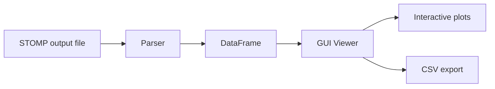
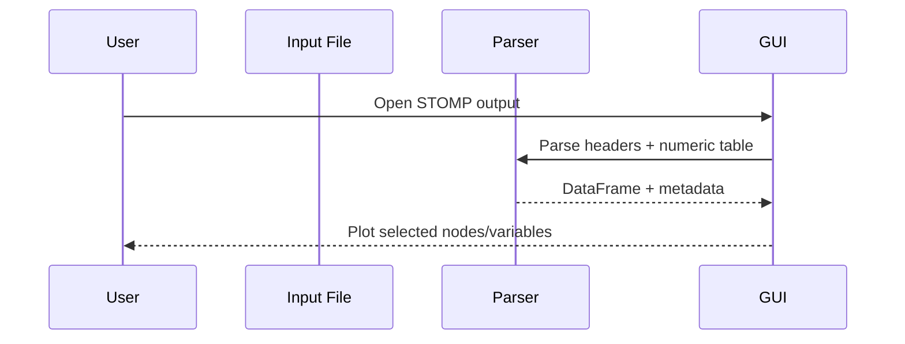

# Architecture

## Overview

This repository is focused on one tool:

1. `node_output_gui_v1.py`: interactive viewer for STOMP reference-node outputs

Sample input file included for demonstration:

- `results/output_ex.txt`

## System Diagram

## Data Flow

## Key Design Choices

- The parser reads STOMP-style reference-node headers and units directly from the file.
- Numeric parsing uses pandas for performance on large files.
- File loading is done in a background thread to keep the UI responsive.
